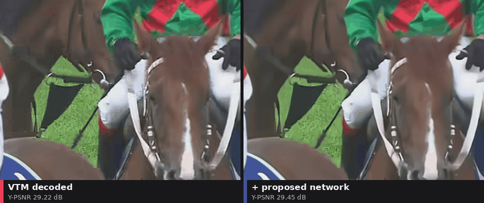
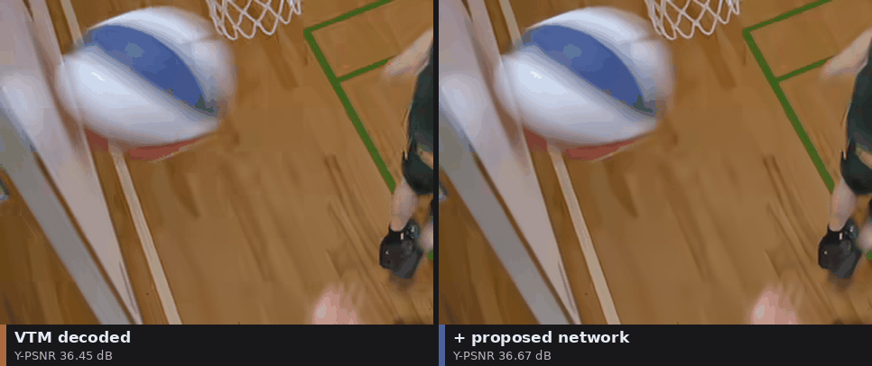
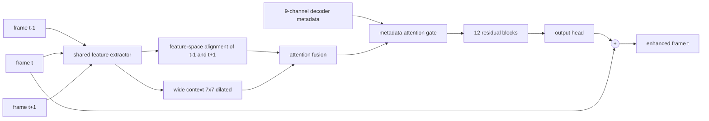

# VVC CNN inter-frame enhancement

A post-processing CNN that cleans up video decoded with **H.266/VVC** in inter (Random Access) mode.
It looks at three consecutive decoded frames, listens to what the **decoder already knows**
(QP, prediction modes, block partitioning, motion vectors) and predicts a correction of the
current frame. The bitstream and the decoder stay untouched.

<p align="center">
  
</p>

<p align="center"><i>Left: VTM 23.14 decoded, QP 37, in-loop filters off. Right: the same frames after the proposed network. RaceHorses (JCT-VC class C), crop.</i></p>

## Highlights

- **-4.70 % BD-rate (Y)** under the JVET common test conditions on JCT-VC classes B-E, the best
  result among five compared architectures in every natural-video class, with 1.29 M parameters.
- **Decoder metadata pays off.** Disabling the metadata path costs 1.06 pp of BD-rate; the module
  that consumes it is 1.7 % of the network.
- **It is mostly the QP map.** A leave-one-out ablation over the nine metadata channels shows that
  removing QP costs 2.16 pp, while motion vectors, partitioning and prediction modes, removed one at
  a time, do not change the result measurably.
- **Honest negative results included:** with in-loop filters enabled no out-of-loop network gives a
  net gain, and bolting the same metadata onto a single-frame network (VVC-PPFF) does not work.
- Four literature baselines reimplemented and trained under identical conditions:
  VVC-PPFF, STENet, Bi-ConvLSTM, QG-ConvLSTM.

<p align="center">
  
</p>

<p align="center"><i>BasketballDrill (JCT-VC class C), same setting.</i></p>

## How it works



- **Input:** three reconstructed YUV frames (chroma upsampled to luma resolution) and a metadata map
  built from the VTM decoder trace: QP, PredMode, Depth, block Boundary, MVL0 x/y, MVL1 x/y, FrameType.
  Block values are painted over the pixels of each coding block.
- **Metadata attention:** 1x1 convolutions turn the metadata into a multiplicative gate on the fused
  features, so the network can correct differently depending on how a region was coded.
- **Hybrid loss:** L1 + MS-SSIM + Sobel + Laplacian on luma, plain MSE on chroma. The multi-term loss
  on all channels gives the best luma but wrecks chroma; splitting the objectives keeps both.
- **Output:** a residual added to the current frame, so an untrained network starts near identity.

## Results

### JVET common test conditions

VTM 23.14, Random Access, QP 22/27/32/37, first 64 frames. All architectures retrained on multi-QP
VTM data. Mean per-sequence BD-rate (PCHIP) over JCT-VC classes B-E, 17 sequences; negative means
bitrate saving at equal quality.

| Model | BD-Y, in-loop filters off | BD-Y, in-loop filters on |
|---|---:|---:|
| **Proposed** | **-4.70 %** | +0.03 % |
| Proposed, metadata path inactive | -3.64 % | +1.02 % |
| STENet | -3.39 % | +0.46 % |
| QG-ConvLSTM | -3.15 % | +0.15 % |
| Bi-ConvLSTM | -0.05 % | 0.00 % |
| VVC-PPFF | +0.96 % | n/a |

Chroma BD-rate is positive for every model in this setting: the VTM anchor is nearly transparent in
U/V, so tiny PSNR changes turn into large percentages.

### Which metadata channel matters?

Each channel zeroed in training and in evaluation, filters off, full model = -4.70 %.

| Channel removed | BD-Y | Contribution |
|---|---:|---:|
| **QP** | -2.55 % | **+2.16 pp** |
| FrameType | -4.98 % | -0.28 pp |
| MVL0 y | -4.94 % | -0.24 pp |
| PredMode | -4.93 % | -0.23 pp |
| Depth | -4.90 % | -0.20 pp |
| MVL1 x | -4.85 % | -0.15 pp |
| Boundary | -4.85 % | -0.15 pp |
| MVL1 y | -4.77 % | -0.07 pp |
| MVL0 x | -4.72 % | -0.02 pp |
| all four MV channels | -4.93 % | -0.22 pp |

Single training run per variant, so differences of a few tenths of a point are within noise.
The direction is clear though: QP carries the useful signal, the rest the network can infer from pixels.

### Supplementary evaluation

VVenC, in-loop filters off, 10 Xiph sequences disjoint from the training pool, QP 22-42.
Models trained at a single base QP of 32; BD-rate on set-averaged RD curves.

| Model | Y | U | V | Params |
|---|---:|---:|---:|---:|
| Bi-ConvLSTM | -0.62 % | +2.65 % | +2.60 % | 0.36 M |
| STENet | -3.68 % | +8.32 % | +9.34 % | 0.76 M |
| VVC-PPFF | -1.82 % | -1.59 % | -2.54 % | 2.78 M |
| Proposed, no metadata module | -2.09 % | -1.43 % | -1.76 % | 1.27 M |
| **Proposed** | -3.06 % | -1.39 % | -1.83 % | 1.29 M |

Raw per-QP and per-sequence numbers live in `bdrate_results/` and `bdrate_results_ctc/`.

## Quick start

```bash
uv sync                                   # Python environment
bash bin/fetch_vtm.sh                     # VTM 23.14 (decoder with block statistics trace)
bash bin/fetch_vvc_enc.sh                 # VVenC

# supplementary evaluation of a trained checkpoint
uv run python fetch_eval_videos.py
uv run python prepare_eval.py
uv run python evaluate_bd.py --model martell --checkpoint checkpoints/martell_hybrid_best.pt \
    --out bdrate_results/martell_hybrid.json
```

Full CTC run for one model (repeat with `--variant on` for the in-loop-filter variant):

```bash
uv run python ctc_vtm_prepare.py --variant off --classes B,C,D,E      # test data
uv run python mqp_prepare.py --variant off                            # multi-QP training data
uv run python train_mqp.py --model martell_hybrid --variant off --wd 0 --tag mqpnwd
uv run python ctc_vtm_evaluate.py --variant off --classes B,C,D,E --models martell_hybrid_mqpnwd_off
```

Per-channel ablation: add `--zero-meta <idx> --tag abl<idx>` to `train_mqp.py` and set
`VVC_ZERO_META=<idx>` for `ctc_vtm_evaluate.py` (channel order as in `evaluate_bd.FEATURE_ORDER`).
The exact command sequences that produced the reported numbers are in `scripts/queue/`.

## Repository layout

```
enhancer/models/          network definitions
  snow_wide.py              proposed network (SnowWideEnhancer)
  snow_wide_nometa.py       ablation without the metadata attention module
  snow_wide_unet.py         U-Net variant
  vvc_ppff.py, stenet_2024.py, bi_conv_lstm.py, qg_conv_lstm.py    baselines
  vvc_ppff_meta.py          VVC-PPFF with decoder metadata (negative result)
encoder/ decoder/ features_parser/ features_generator/    data pipeline (VVenC, VTM trace, metadata maps)
train_*.py                single-QP training drivers
train_mqp.py              multi-QP training of any architecture on VTM data
evaluate_*.py             BD-rate, patch-grid and perceptual evaluation
ctc_vtm_prepare.py  mqp_prepare.py  ctc_vtm_evaluate.py  ctc_bd.py    CTC pipeline
scripts/queue/            shell scripts that ran the experiments
bdrate_results*/          raw results (JSON)
logs/train  logs/eval  logs/ctc    training and evaluation logs
assets/                   images used in this README
```

In the code the proposed network is called `martell_hybrid`
(architecture `SnowWideEnhancer` + hybrid loss).

## Notes

- Everything was trained and evaluated on a single consumer GPU (RTX 5070, 12 GB). GPU entry points
  take an exclusive file lock (`gpu_lock.py`), so jobs queued in parallel run one after another.
- The training pool is small (53 Xiph sequences, 64 frames each), so absolute numbers are a lower
  bound and are not comparable with results published for the baselines; comparisons inside this
  repository are, because every model saw the same data and schedule.
- MSE-trained baselines are trained without weight decay. With Adam and a residual MSE loss,
  `weight_decay=1e-4` silently drives the convolution weights to zero and the model collapses to identity.
- PSNR is measured per channel in native 4:2:0 on frames that have both neighbours. An identity-model
  control bounds the chroma up/down-sampling round trip at +/-0.07 dB.
- Not stored in git: source sequences and encoded/decoded data (`data*/`, `output_*/`, about 500 GB)
  and recent checkpoints (`checkpoints/`). All of it can be regenerated with the scripts above.
  Training scripts write logs to the repository root; logs of the reported runs are kept in `logs/`.

## References

- VVC-PPFF: *Versatile Video Coding-Post Processing Feature Fusion*, Appl. Sci. 2024.
- STENet: *Joint Reference Frame Synthesis and Post Filter Enhancement for VVC*, [arXiv:2404.18058](https://arxiv.org/abs/2404.18058).
- QG-ConvLSTM: Yang et al., *Quality-Gated Convolutional LSTM for Enhancing Compressed Video*, ICME 2019, [arXiv:1903.04596](https://arxiv.org/abs/1903.04596).
- Bjøntegaard, *Calculation of average PSNR differences between RD-curves*, VCEG-M33, 2001.
- JVET common test conditions for SDR video, JVET-T2010.
